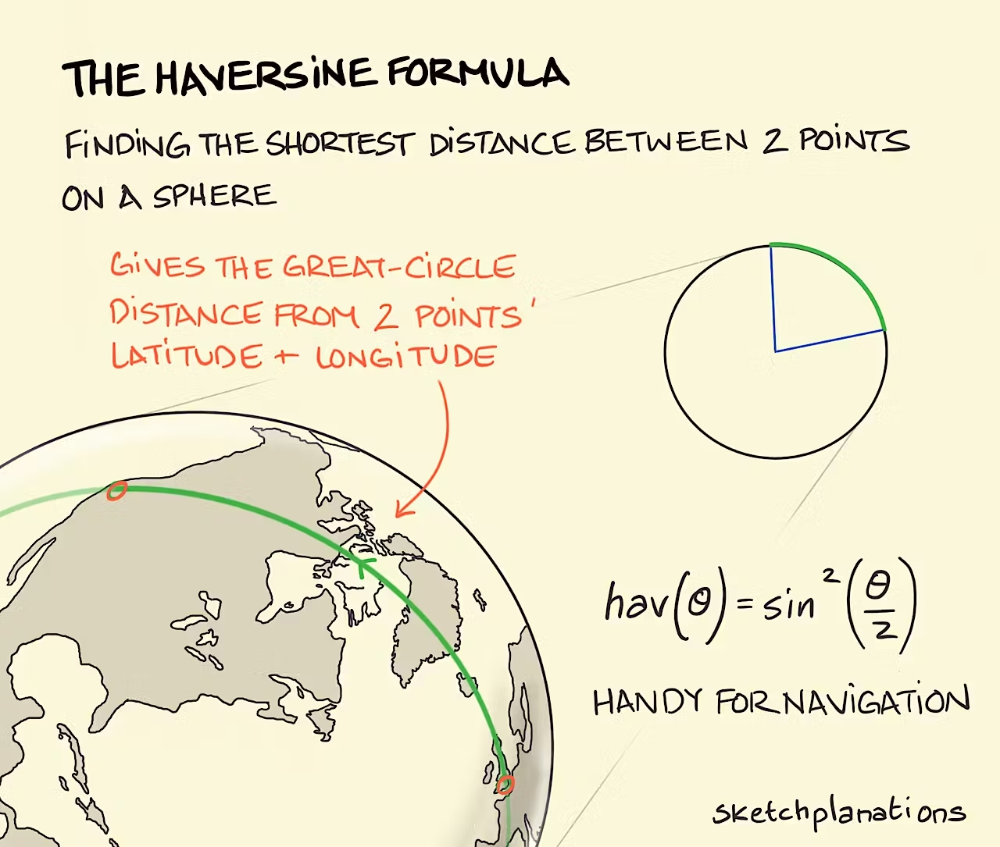

# 📍 Geolocation Manager Vue

[](https://www.npmjs.com/package/@rodolphe37/vue-haversine-geolocation)

[](./LICENSE)

A **Vue 3 composable** to manage a geolocation history, using the **Haversine formula** to filter out nearby points and optimize tracking.


## 🚀 Installation

```bash
npm install @rodolphe37/vue-haversine-geolocation
```

---

## ✨ Features

- 📍 Calculate distances in meters using the **Haversine formula**
- 🔄 Manage a geolocation history
- 🎯 Automatically filter out points that are too close to the previous one
- 💾 Flexible persistence (via `localStorage`, `SQLite`, etc.)

---

## 🖥️ Live demo :

https://vue-geolocation-test.netlify.app/

---

## 🔧 Utilisation

```vue
<script setup lang="ts">
import { onMounted } from "vue";
import {
  useGeolocationManager,
  loadFromLocalStorage,
  saveToLocalStorage,
} from "@rodolphe37/vue-haversine-geolocation";

const { history, init, addLocation } = useGeolocationManager({
  distanceThreshold: 200,
  loadHistory: loadFromLocalStorage,
  saveHistory: saveToLocalStorage,
});

onMounted(() => {
  init();
});

function addDummy() {
  addLocation({
    timestamp: Date.now(),
    mocked: false,
    coords: {
      accuracy: 5,
      altitude: 0,
      altitudeAccuracy: 0,
      heading: 0,
      latitude: 48.8566,
      longitude: 2.3522,
      speed: 0,
    },
  });
}
</script>

<template>
  <div>
    <button @click="addDummy">Ajouter Paris</button>
    <ul>
      <li v-for="loc in history.locations" :key="loc.timestamp">
        {{ loc.coords.latitude }}, {{ loc.coords.longitude }} @
        {{ new Date(loc.timestamp).toLocaleString() }}
      </li>
    </ul>
  </div>
</template>
```

## 🔍 Advanced Examples

### Using `navigator.geolocation.watchPosition`

```ts
navigator.geolocation.watchPosition((pos) => {
  addLocation({
    timestamp: pos.timestamp,
    mocked: false,
    coords: {
      accuracy: pos.coords.accuracy,
      altitude: pos.coords.altitude ?? 0,
      altitudeAccuracy: pos.coords.altitudeAccuracy ?? 0,
      heading: pos.coords.heading ?? 0,
      latitude: pos.coords.latitude,
      longitude: pos.coords.longitude,
      speed: pos.coords.speed ?? 0,
    },
  });
});
```

### Create a derived composable: last known location

```ts
import { computed } from "vue";
import { useGeolocationManager } from "@rodolphe37/vue-haversine-geolocation";

export function useLastLocation(options) {
  const { history, ...rest } = useGeolocationManager(options);
  const last = computed(() => history.locations.at(-1) ?? null);
  return { last, history, ...rest };
}
```

## 🧪 Tests

```bash
npm run test
```

## 📦 Build

```bash
npm run build
```

---

## 📐 Distance Calculation (Haversine)

The distance between two GPS points is calculated using the Haversine formula, which determines the great-circle distance between two points on a sphere using their latitude and longitude.



This formula is useful for:

Filtering out GPS points that are too close to each other.

Reducing noise in location tracking.

Optimizing storage and performance by avoiding redundant points.

Function signature:

```ts
getDistanceInMeters(lat1, lon1, lat2, lon2): number
```

- Parameters:

  - lat1, lon1 – latitude and longitude of the first point in decimal degrees.

  - lat2, lon2 – latitude and longitude of the second point in decimal degrees.

- Returns: distance in meters.

### Example

```ts
import { getDistanceInMeters } from "@rodolphe37/vue-haversine-geolocation";

const distance = getDistanceInMeters(48.8566, 2.3522, 40.7128, -74.006);
console.log(`Distance: ${distance.toFixed(2)} meters`);
```

---

## 📜 License

MIT © 2025
